# Processing Pipeline Overview

This diagram shows the high-level processing path from a declared `Model` to a
final Feynman rule.

```mermaid
flowchart LR
    A["Model(...)<br/>fields, parameters, gauge groups,<br/>declared Lagrangian"]
    B["DeclaredLagrangian<br/>source_terms"]
    C["feynpy.lowering<br/>analyze and classify each source term"]
    D["compiler.gauge<br/>expand and lower structured terms"]
    E["InteractionTerm tuple"]
    F["CompiledLagrangian"]
    G["feynman_rule(...)<br/>select one vertex"]
    H["InteractionTerm.to_vertex_kwargs(...)"]
    I["symbolic.vertex_engine<br/>contract fields and derivatives"]
    J["postprocessing<br/>simplify and canonicalize"]
    K["Symbolica Expression<br/>final Feynman rule"]

    A --> B
    B --> C
    C --> D
    D --> E
    E --> F
    F --> G
    G --> H
    H --> I
    I --> J
    J --> K
```

## Reading

- `feynpy.lowering` routes declarative syntax into the compiler and validates
  index labels.
- `compiler.gauge` compiles structured terms such as `CovD`, `FS`,
  gauge-fixing and ghost contributions.
- After compilation, the symbolic engine sees only the interaction-level IR:
  `InteractionTerm`.

Use this figure for workflow explanations. Use `src_overview.md` when the text
is about package structure.
