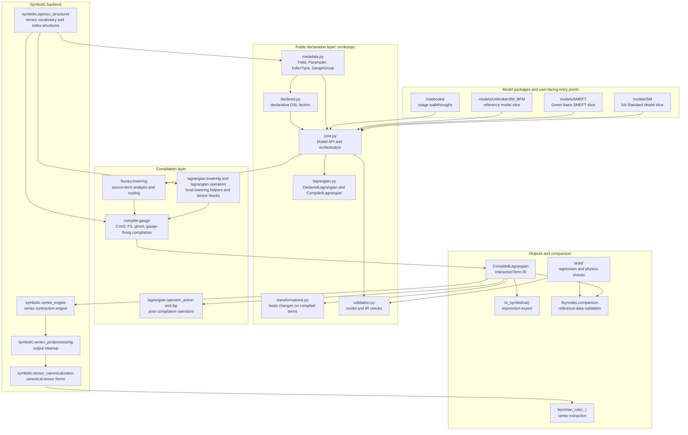

# Code Structure Overview

This diagram shows the main FeynPy layers, what each layer owns, and how
information moves between them.

## Reading

- `src/feynpy` is the public model layer.
- `src/compiler` turns structured declarations into plain interaction terms.
- `src/symbolic` is the downstream symbolic backend used for contraction and
  canonicalization.
- `models/*` are complete physics applications built on top of the reusable
  engine.
