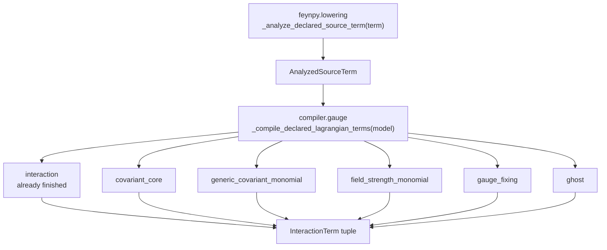
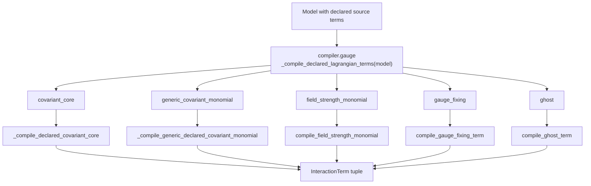
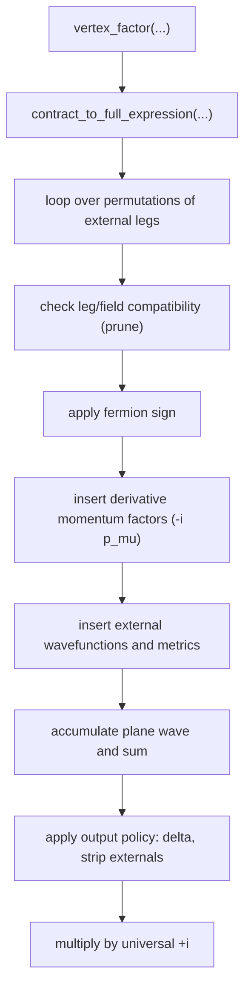

# From a Declared Model to a Feynman Rule: Inside the Pipeline

> Draft chapter on the internal workings of FeynPy. It is meant as raw
> material: it explains *how* the code turns a declared model into a Feynman
> rule, layer by layer, and it flags the places where the design was hardest.
> Rewrite it in your own words before it goes into the thesis.

## 1. Overview

The previous chapter described FeynPy from the outside: how a user declares
indices, fields, gauge groups and a Lagrangian, and then calls
`feynman_rule(...)`. This chapter looks inside that call. The goal is to make
the machine transparent — to show that a Feynman rule is produced by a sequence
of small, inspectable transformations rather than by one opaque routine.

The design follows a single principle: **a declared Lagrangian is progressively
rewritten into simpler and simpler representations until it reaches a form that
a generic symbolic contraction engine can consume.** Every stage has one job,
takes one well-defined input, and produces one well-defined output. Nothing in
the symbolic engine knows what a covariant derivative is; nothing in the
declaration layer knows how a Wick contraction is performed. This separation is
what makes the pipeline both testable and extensible.

The end-to-end flow is shown in Figure 1. It reads left to right, from the
user's `Model` object to the final Symbolica expression.

```mermaid
flowchart LR
    A["Model(...)<br/>fields, parameters, gauge groups,<br/>declared Lagrangian"]
    B["DeclaredLagrangian<br/>source_terms"]
    C["feynpy.lowering<br/>analyze and classify each source term"]
    D["compiler.gauge<br/>expand and lower structured terms"]
    E["InteractionTerm tuple"]
    F["CompiledLagrangian"]
    G["feynman_rule(...)<br/>select one vertex"]
    H["InteractionTerm.to_vertex_kwargs(...)"]
    I["symbolic.vertex_engine<br/>contract fields and derivatives"]
    J["postprocessing<br/>simplify and canonicalize"]
    K["Symbolica Expression<br/>final Feynman rule"]

    A --> B --> C --> D --> E --> F --> G --> H --> I --> J --> K
```



**Figure 1. The processing pipeline from a declared model to a Feynman rule.**

Four layers carry the work, and the source tree mirrors them exactly:

| Layer | Package | Responsibility | Must *not* know about |
|-------|---------|----------------|-----------------------|
| Declaration | `src/feynpy` (`metadata`, `declared`, `core`) | Represent the physics the user wrote | Contraction, canonicalization |
| Lowering / analysis | `src/feynpy/lowering`, `src/lagrangian` | Classify terms, validate indices, produce local monomials | Vertex extraction |
| Compilation | `src/compiler` | Expand gauge structure into local monomials | Symbolica output policy |
| Symbolic backend | `src/symbolic` | Contract, simplify, canonicalize | Declarative syntax |

### 1.1 The two libraries underneath

Before diving into the layers it helps to name the two libraries every stage
relies on, because the split between them is what makes the rest possible.

- **Symbolica** ([symbolica.io](https://symbolica.io)) is a high-performance
  computer-algebra system — a Rust engine with native Python bindings. Every
  object in the pipeline (a coupling, a momentum, a γ-matrix, a whole vertex) is
  ultimately a Symbolica `Expression`, i.e. a first-class Python value with no
  string round-tripping. Two features are used everywhere: **pattern matching
  with wildcards** (symbols whose name ends in `_`), which is literally how the
  contraction engine remaps an open index — `coupling.replace(open_label,
  target_label)` — and a fast **polynomial core** (multivariate GCD,
  factorisation) that keeps the large permutation sums compact under
  `.expand()`/`.collect()`. Symbolica can also put *tensor* expressions in a
  canonical form via `canonize_tensors`, using `is_symmetric`/`is_antisymmetric`
  flags on tensor heads — the primitive Section 7 builds on.

- **Spenso** ([github.com/alphal00p/spenso](https://github.com/alphal00p/spenso))
  is a tensor-network library on top of Symbolica that gives indices *meaning*.
  Symbolica alone sees `G(mu, a)` as a function of two opaque arguments; Spenso
  turns each index into a **`Slot` = `(Representation, abstract_index)`**, and a
  `Representation` fixes both the dimension and the transformation law. The
  toolkit uses exactly six:

  | Representation | Self-dual? | Used for |
  |----------------|-----------|----------|
  | `mink(4)` | yes | Lorentz vector indices `μ,ν,…` |
  | `bis(4)`  | yes | Dirac bispinor indices |
  | `cof(3)`  | **no** | SU(3) colour fundamental (quark) |
  | `coad(8)` | yes | SU(3) colour adjoint (gluon, `T^a`, `f^{abc}`) |
  | `cof(2)`  | **no** | SU(2)_L weak doublet |
  | `coad(3)` | yes | SU(2)_L weak triplet |

  The *self-dual* column matters: `cof` is **dualizable** (a quark's
  fundamental index and an antiquark's antifundamental index are different
  representations, so Spenso only lets a fundamental contract with an
  antifundamental), whereas `mink`/`bis`/`coad` have a metric and are self-dual,
  so any two matching slots contract directly. Because each slot already carries
  its representation, **Spenso — not the toolkit — decides what is
  contractible**, and the toolkit only ever tracks index *labels*. A typed
  tensor is built by calling a `TensorName` on typed slots and exporting to
  Symbolica:

  ```python
  # symbolic/spenso_structures.py
  def gauge_generator(adj_index, fund_left, fund_right):
      """t^a_{ij}: adjoint x fundamental x fundamental."""
      return TensorName.t()(
          color_adj_index(adj_index),    # Representation.coad(8)(adj_index)
          color_fund_index(fund_left),   # Representation.cof(3)(fund_left)
          color_fund_index(fund_right),  # Representation.cof(3)(fund_right)
      ).to_expression()
  ```

- **idenso** is Spenso's physics-aware simplifier: `simplify_metrics` (Kronecker
  / metric chains), `simplify_color` (SU(N) Fierz collapses of `T^a`/`f^{abc}`
  networks) and `simplify_gamma` (Clifford algebra). The toolkit composes them
  into one pass, `simplify_invariants`, run in the order *metrics → colour →
  gamma → metrics* because each pass can expose fresh metric pairs.

The toolkit ties the three together with `IndexType`, which pairs one Spenso
`Representation` with a cheap string `kind` key used everywhere internally.

The rest of the chapter walks these layers from the outside in. We start with
how a model is written down (Section 2), then how it is analysed and its
indices are resolved (Section 3), then how gauge structure is compiled
(Section 4), then the central intermediate representation that ties everything
together (Section 5), then the Wick-contraction engine that produces the actual
vertex (Section 6), and finally the canonicalization that makes the output
comparable to a reference (Section 7). Section 8 collects the hardest problems
encountered while building the pipeline.

A concrete Lagrangian will accompany the discussion — gauge-fixed QCD —

$$
\mathcal{L}_{\mathrm{QCD}}
= i\,\bar q\,\gamma^\mu D_\mu q
\;-\;\tfrac14 F^a_{\mu\nu} F^{a\,\mu\nu}
\;-\;\tfrac{1}{2\xi}\left(\partial^\mu A^a_\mu\right)^2
\;-\;\bar c^{\,a}\,\partial^\mu (D_\mu c)^a ,
$$

because it exercises every branch of the compiler at once: a covariant matter
kinetic term, a field strength, a gauge-fixing term and a ghost term.

---

## 2. The outer layer: declaring a model

### 2.1 Metadata objects

Everything begins with declarative *metadata* in `src/feynpy/metadata.py`. These
are frozen dataclasses that hold physics data and carry no algorithmic logic.
The important ones are:

- **`IndexType`** — one kind of index a field can carry. It pairs a Spenso
  `Representation` (the object that actually knows the tensor algebra) with a
  stable string `kind` used to match indices through the pipeline, plus a
  `prefix` used when dummy labels are auto-generated and an `is_flavor` flag.
  Six constants cover the standard cases: `SPINOR_INDEX`, `LORENTZ_INDEX`,
  `COLOR_FUND_INDEX`, `COLOR_ADJ_INDEX`, `WEAK_FUND_INDEX`, `WEAK_ADJ_INDEX`.

- **`Field`** — a particle. It stores a name, spin, self-conjugacy, its tuple of
  `indices`, its Symbolica `symbol` (and `conjugate_symbol`), quantum numbers,
  and optional flavor-class data. From the spin it infers `kind`
  (scalar/fermion/vector) and `statistics` (boson/fermion). A field is callable:
  `Quark(i, c)` produces a `FieldOccurrence` with labels bound to slots, and
  `Quark.bar` produces the conjugated occurrence.

- **`Parameter`** — a coupling, mass or coupling matrix. It behaves
  algebraically like its Symbolica symbol, and may carry indices (e.g. a Yukawa
  matrix `Yu(i, j)`) together with explicit `components` for flavor expansion.

- **`GaugeRepresentation`** and **`GaugeGroup`** — the symmetry data. A
  representation ties an `IndexType` to a `generator_builder` (the function that
  builds `T^a_{ij}`). A group records whether it is `abelian`, its `coupling`,
  its `gauge_boson`, its `ghost_field`, its `structure_constant` builder and its
  matter `representations`. For an abelian group the matter coupling is read
  from a `charge` quantum number; for a non-abelian group it comes through the
  generator and structure constant.

The deliberate point here is that metadata is *inert*. It is a faithful,
machine-readable copy of what a physicist would write on paper. All behaviour
lives downstream.

### 2.2 The declarative DSL

The Lagrangian itself is written with a small domain-specific language in
`src/feynpy/declared.py`. Its building blocks — `CovD`/`DC`, `FS`/`FieldStrength`,
`Gamma`, `PartialD`, `Metric`, `T`, `StructureConstant`, `GaugeFixing`,
`GhostLagrangian` — are **wrapper objects**, not Symbolica expressions. When the
user writes

```python
I * Quark.bar * Gamma(mu) * CovD(Quark, mu)
```

Python's operator overloading assembles a `_DeclaredMonomial`: a coefficient
(`I`) times an ordered tuple of factors (`_FieldFactor(Quark, conjugated=True)`,
`GammaFactor(mu)`, `CovariantDerivativeFactor(Quark, mu)`). Nothing is evaluated
yet. The declaration is kept in *source form* precisely so it can be inspected,
transformed and lowered later. This is the FeynRules idea of a model file, but
expressed directly in Python objects.

A subtlety worth noting is that a few helpers are *dual*. `Gamma(mu)` is an
opaque placeholder that means "build the spinor chain from the neighbouring
fields", while `Gamma(i, j, mu)` is the fully explicit Spenso tensor
`gamma(i, j, mu)`. The same holds for `T(a)` versus `T(a, i, j)`. This lets the
user stay compact when the structure is obvious and become explicit when it is
not.

### 2.3 The `Model` object and `DeclaredLagrangian`

`Model` in `src/feynpy/core.py` is the orchestrator. Its constructor accepts the
declared Lagrangian (as a positional shorthand or via `lagrangian_decl=`), plus
optional `fields`, `parameters` and `gauge_groups`. Construction does three
things:

1. it coerces the declaration into a `DeclaredLagrangian`, whose only payload is
   an ordered tuple of `source_terms`;
2. it *infers missing metadata* by scanning those source terms — fields, gauge
   bosons, ghosts and flavor members can be discovered automatically, so simple
   models need very little boilerplate;
3. it *validates* every source term by running the analysis pass (Section 3),
   so an unsupported construction fails immediately at declaration time rather
   than silently producing a wrong vertex later.

Compilation is lazy and cached. The first call to `model.lagrangian()` invokes
the compiler and stores the resulting `CompiledLagrangian`; later calls reuse
it. `DeclaredLagrangian` and `CompiledLagrangian` are intentionally different
types with different algebra: you can add declarative terms to declarative
terms, and compiled terms to compiled terms, but mixing the two raises an error
that points you back through `model.lagrangian()`. That strictness keeps the
"source" and "compiled" worlds from leaking into each other.

---

## 3. Analysis and lowering: reading the Lagrangian and resolving indices

The lowering layer (`src/feynpy/lowering.py`, with model-agnostic helpers in
`src/lagrangian/lowering.py`) is the bridge between declarative syntax and the
compiler. It answers three questions for each source term: *what kind of term is
this?*, *are its indices well-formed?*, and — if the term is already local —
*what is its canonical interaction form?*

### 3.1 Classifying each source term

The single entry point is `_analyze_declared_source_term(...)`, which returns an
`AnalyzedSourceTerm`. This record is the model layer's source of truth: the
compiler consumes it and never re-derives the classification. The categories
are:

| Category | Meaning | Example |
|----------|---------|---------|
| `interaction` | already a local `InteractionTerm`; no compilation needed | `lam * phi**4` |
| `covariant_core` | a canonical kinetic term `ψ̄ iγ^μ D_μ ψ` or `(D_μΦ)†(D^μΦ)` | quark kinetic term |
| `field_strength_monomial` | a product of `FieldStrength(...)` factors | `-¼ F^a F^a` |
| `generic_covariant_monomial` | any other monomial containing `CovD` | `ψ̄ γ^μ D_μ ψ · ψ̄ γ^ν D_ν ψ` |
| `gauge_fixing` | a gauge-fixing declaration | `GaugeFixing(SU3, ξ)` |
| `ghost` | a ghost declaration | `GhostLagrangian(SU3)` |

Classification is priority-ordered: the analyser tries "already local" first,
then the canonical covariant kinetic shapes, then field strengths, then
gauge-fixing, then ghosts, and finally the general covariant-monomial catch-all.
The `needs_compilation` property is true for everything except the first
category. Figure 2 shows this dispatch.



**Figure 2. Every analysed source term is routed to exactly one compiler branch,
and every branch ends in the same intermediate representation.**

### 3.2 Resolving the indices

This is the part of the pipeline where "expanding the indices" actually happens,
and it received a disproportionate amount of care because it is where silent
errors are most dangerous.

**Monomial-wide label validation.** In the compact notation the user writes
plain symbolic labels such as `mu`, `a`, `c` or `f`. On paper these are unambiguous
because a human reads the whole term at once. The code must reproduce that
global reading. Before anything else, the analyser builds one registry that maps
every label *name* used anywhere in a monomial — on field slots, on declared
factors like `PartialD`, `Gamma`, `T`, `f^{abc}`, `FieldStrength`, and even on
raw Spenso tensors in the coefficient — to exactly one `IndexType`. If the same
name is used for two incompatible index kinds (say a colour label reused as a
generation label), the term is rejected with an explicit error. This closes a
real hole: earlier the labels were validated slot-locally, so an inconsistent
term like `q.bar(f, c) * q(c, f) * Φ` could compile into a wrong contraction.

**Slot binding and inference.** Once labels are typed, local monomials pass
through a small state machine that, in a fixed order:

1. seeds any explicit labels written by the user;
2. applies chain factors (`Gamma`, `T`) between adjacent fields, connecting
   spinor and colour endpoints;
3. binds remaining typed labels to open field slots *by kind*, requiring a
   one-to-one match and raising an ambiguity error otherwise;
4. shares fresh labels across natural pairs (an adjacent `ψ̄`/`ψ`, a unique open
   bar/field pair);
5. invents fresh dummy labels, using the index-type prefix, for whatever is
   left.

The result is that a physicist can write very little and still get a fully and
unambiguously indexed term — or a clear error if what they wrote cannot be
resolved uniquely.

### 3.3 Producing a local interaction, and remembering fermion pairings

When a term is already local, lowering builds an `InteractionTerm` directly (see
Section 5). During this step it also records **which fermion occurrences form
closed Dirac bilinears** — the `closed_dirac_bilinears` metadata. This is a list
of `(ψ̄-slot, ψ-slot)` pairs, inferred from gamma-matrix chains, from repeated
spinor labels, or from the spinor graph of the coefficient. It records the
physicist's intent (which "current" pairs with which) so that the contraction
engine can later apply the correct fermion sign. Its importance is discussed in
Section 8.

---

## 4. Compilation: turning gauge structure into ordinary interactions

The compiler (`src/compiler/gauge.py` and its helpers) is where the physics of
gauge symmetry is applied. Its top-level function
`_compile_declared_lagrangian_terms(model)` walks the source terms, re-runs the
analysis, and dispatches each analysed term to a specialised handler. The
governing conventions are fixed once, in the module docstring:

$$
D_\mu = \partial_\mu - i g A_\mu,
\qquad
F^a_{\mu\nu} = \partial_\mu A^a_\nu - \partial_\nu A^a_\mu + g f^{abc} A^b_\mu A^c_\nu .
$$

### 4.1 The expand-then-lower principle

The single most important design decision in the compiler is that it **does not
build vertices from gauge operators directly**. Instead, each structured
operator is *expanded* into ordinary local monomials — partial-derivative
pieces, gauge-current pieces, and explicit generator or structure-constant
factors — and those local monomials are then sent back through the same local
lowering used for hand-written interactions (Section 3). Figure 3 shows the
dispatch, and the same idea underlies every branch.



**Figure 3. Compiler dispatch. Structured operators are expanded into local
monomials and re-lowered; every branch returns ordinary `InteractionTerm`s.**

The payoff is large: there is no separate compiler for `F^2`, `F^3` or `F^4`, no
separate compiler for each covariant power. The combinatorics come for free from
distribution plus a single, well-tested lowering path. The cost is that raw
compiled output is more expanded than a textbook form (a non-abelian `F^2`
becomes nine local monomials, not one), which is later collapsed by
canonicalization (Section 7).

### 4.2 Covariant derivatives

A covariant derivative is, structurally, "a partial derivative plus one gauge
current per group acting on the field". The routine `expand_cov_der` implements
exactly this: it resolves the set of gauge groups the field transforms under —
and if the user did not name a group, it **sums over all of them** — and for each
group emits a gauge piece, plus one partial-derivative piece.

The abelian and non-abelian cases differ only in what the gauge piece carries:

- **Abelian.** The coupling is `g × Q`, where `Q` is the field's charge read from
  its quantum numbers. No generator, no adjoint index.
- **Non-abelian.** The coupling is `g`, and a generator `T^a_{ij}` is inserted,
  rotating the field's representation index; the gauge boson carries the adjoint
  label `a`. If the field carries several slots of the representation index, the
  representation's `slot_policy` decides whether this is an error (the strict
  default) or a sum over all matching slots.

For the canonical fermion kinetic term `iψ̄γ^μ D_μ ψ`, the covariant-core handler
builds the free part `iψ̄γ^μ ∂_μ ψ` and one fermion-current interaction per gauge
piece — for QCD this is the `q̄ γ^μ T^a q · G^a_μ` vertex with coupling `-i g_s`.
For a complex scalar `(D_μΦ)†(D^μΦ)` the same machinery produces both the
single-boson current and the two-boson contact ("seagull") term, including the
mixed contact terms when a scalar transforms under two groups at once.

### 4.3 Field strengths

A `FieldStrength` factor is expanded by `expand_field_strength_factor` into its
additive pieces: two derivative terms for an abelian group, and additionally the
`g f^{abc} A^b A^c` term for a non-abelian group. A monomial containing several
field strengths is then expanded by taking the **full Cartesian product** of the
pieces, so `-¼ F^a F^a` for SU(3) distributes into `3 × 3 = 9` local monomials
spread across the two-, three- and four-gluon sectors. Each resulting monomial
is lowered locally. Higher operators — `f F^3`, `F^4`, mixed-group products such
as `F_{SU3}^2 F_{SU2}^2` — need no new code; they are just larger Cartesian
products. A scalarity check enforces that every adjoint label appears an even
number of times, i.e. that the operator is a genuine gauge singlet.

### 4.4 Gauge fixing and ghosts

The gauge-fixing helper compiles `-(1/2ξ)(∂·A)^2` by building the corresponding
local derivative monomial with the right metric contractions and lowering it,
tagging its provenance as `gauge_fixing` so it can be recognised later by the
reporting and validation layers. Manually written `(∂·A)^2` terms are detected
and tagged the same way, so the helper and the hand-written form are guaranteed
to behave identically.

The ghost handler compiles the non-abelian Faddeev–Popov sector
`-c̄ ∂^μ D_μ c` into its two local pieces: the bilinear `(∂_μ c̄)(∂^μ c)` with the
adjoint metric, and the ghost–gauge vertex `g f^{āab} (∂_μ c̄) A^μ c` with the
group's structure constant. Because a ghost transforms in the adjoint, its
covariant derivative reuses the same representation-aware machinery as matter
fields, rather than a ghost-only code path.

---

## 5. The pivot: the `InteractionTerm` intermediate representation

Every branch above converges on one data type, `InteractionTerm` (in
`src/feynpy/interactions.py`). It is the waist of the hourglass: everything
above it is declarative and physics-aware; everything below it is generic
symbolic machinery.

```python
# src/feynpy/interactions.py (abridged)
@dataclass(frozen=True)
class InteractionTerm:
    coupling: object                        # Symbolica Expression
    fields: tuple[FieldOccurrence, ...]     # bare field factors, in order
    derivatives: tuple[DerivativeAction, ...] = ()
    closed_dirac_bilinears: tuple[tuple[int, int], ...] = ()
    label: str = ""
    sector: str = ""
```

An `InteractionTerm` records:

- a `coupling` — a Symbolica expression holding the numerical/tensor prefactor
  (couplings, generators, structure constants, metrics);
- an ordered tuple of `FieldOccurrence`s — the fields in the vertex, each with
  its slot-resolved index labels and conjugation flag;
- `derivatives` — a tuple of `DerivativeAction(target, lorentz_index)` recording
  which field each derivative hits and along which Lorentz index;
- `closed_dirac_bilinears` — the fermion-pairing provenance from Section 3.3;
- provenance fields (`sector`, `origin`) used by validation and reporting.

The ordering of fields is significant: because Symbolica multiplication is
commutative, the ordered tuple — not the exported Symbolica expression — is the
authoritative record of fermion order. This is why the whole pipeline carries
fermion structure as explicit metadata rather than trusting the algebra to
remember it.

The method `to_vertex_kwargs(external_legs)` translates one `InteractionTerm`
and a chosen set of external legs into the flat dictionary of parallel lists
that the contraction engine consumes: species keys, momenta, field and leg
roles, index labels and types, derivative indices and targets, and the
bilinear metadata. This translation is the last model-aware step; after it, only
Symbolica and Spenso objects remain.

---

## 6. The inner core: Wick contraction in the vertex engine

The vertex engine (`src/symbolic/vertex_engine.py`) is deliberately ignorant of
physics vocabulary. It sees fields, roles, index labels, momenta and a coupling
tensor, and it performs a combinatorial contraction. Figure 4 shows the two
levels: the public wrapper and the contraction core.



**Figure 4. The vertex engine: a permutation sum followed by an output policy.**

### 6.1 The contraction sum

`contract_to_full_expression` sums over all `n!` ways of matching the `n`
external legs to the `n` field slots of the interaction. For each permutation it
builds one contribution:

1. **Coupling remap.** Open index labels in the coupling (those appearing once)
   are relabelled to the labels of the external legs they now contract with.
2. **Compatibility pruning.** Each `(slot, leg)` pairing is checked by
   `factor_leg_compatible`. The check compares stable *match keys* built from
   field identity (name, spin, kind, statistics, index schema, conjugation),
   which lets aliased external species still match the right field, and then
   checks role compatibility. Incompatible permutations are discarded before any
   further work — this is the pruning that made high-multiplicity mixed vertices
   (e.g. `GGGGWWW`) tractable, cutting them from many seconds to well under one.
3. **Fermion sign.** For fermionic terms a Grassmann sign is applied from the
   permutation restricted to fermion slots — unless the closed-bilinear
   exception applies (Section 6.2).
4. **Derivatives → momenta.** Each `DerivativeAction` contributes a factor
   `(-i) p^μ`, where `p` is the momentum of the leg matched to the derivative's
   target. This realises the Fourier convention `∂_μ → -i p_μ` with all momenta
   incoming.
5. **External factors.** Each leg contributes its external wavefunction (`U` for
   bosons, `UF`/`UbarF` for fermions) together with a species Kronecker delta,
   and repeated explicit indices are contracted through the appropriate Spenso
   representation metric.
6. **Plane wave.** The contribution is multiplied by `exp(-i Σp·x)` and added to
   the running total.

For a purely bosonic vertex all signs are `+1`, so the sum is a permanent over
compatible pairings; for fermions each term carries its sign. In outline:

```python
# src/symbolic/vertex_engine.py (essential shape)
for perm in permutations(range(n)):
    term = coupling_with_open_indices_remapped_along(perm)   # .replace(...)
    if not all(factor_leg_compatible(i, perm[i], ...) for i in range(n)):
        continue                        # prune impossible pairing early
    if statistics == "fermion" and not use_closed_dirac_bilinear_signs:
        term *= fermion_sign(perm, fermion_slots)
    for mu, tgt in zip(derivative_indices, derivative_targets):
        term *= (-I) * pcomp(ps[perm[tgt]], mu)              # ∂_μ → -i p_μ
    for i, j in enumerate(perm):
        term *= external_factor(role[i], alphas[i], betas[j], ps[j], ...)
    term *= plane_wave(sum_of_matched_momenta, x)
    total += term
```

Nothing here is specific to Lorentz or colour indices: an index is just a
`(kind, label)` pair, and "open" vs. "internal" is decided purely by how many
times a label occurs. That is why the *same* engine derives QED, QCD,
electroweak and ghost vertices without a single index-kind-specific branch.

### 6.2 Fermion signs and the closed-bilinear exception

Fermion signs were the single most delicate piece of physics in the engine. The
generic rule is the flat Grassmann sign of the fermion permutation. But this
gives the *wrong relative sign* for a product of closed Dirac bilinears compared
to the FeynRules convention: for identical-fermion current–current operators the
flat rule produces `direct − crossed`, whereas the reference gives
`direct + crossed`.

The resolution is metadata-driven and narrow. When — and only when — every Dirac
fermion slot is covered exactly once by the `closed_dirac_bilinears` pairs
carried down from lowering, the engine suppresses the flat permutation sign and
uses the all-plus bilinear convention. Generic open multi-fermion tensors keep
the flat Grassmann sign. This is exactly the right boundary: it adopts the
convention where the term genuinely is a product of closed currents, and nowhere
else.

### 6.3 The output policy and universal factors

`vertex_factor` wraps the contraction and then applies an *output policy*:

- with `include_delta=True`, the accumulated plane wave `exp(-i Σp·x)` is
  replaced by the momentum-conservation factor `(2π)^d δ(Σp)`; the high-level
  API omits this by default;
- with `strip_externals=True` (the default), the external wavefunctions `U`,
  `UF`, `UbarF` are amputated, giving the bare vertex;
- finally, the whole result is multiplied by the **universal overall `+i`** that
  every vertex carries.

The separation is intentional: the contraction is pure combinatorics; the
choice of whether to display the delta, or amputate the legs, is a presentation
policy layered on top.

---

## 7. Making the answer canonical

The raw contracted expression is correct but not unique: the same vertex can be
written with different dummy-index names, different orderings of antisymmetric
tensors, or in an over-expanded field-strength basis. To compare against a
reference (or against itself across runs) the output must be brought to a
canonical form. This is the job of `src/symbolic/tensor_canonicalization.py`,
orchestrated by `canonize_full`.

Its strategy is to keep live Spenso tensor heads during computation, and only at
canonicalization time swap them temporarily for heads that carry explicit
symmetry information, so that Symbolica's `canonize_tensors` can act. Concretely,
each Spenso head (metric, `T^a`, `f^{abc}`, `γ`, and the custom invariants
`d^{abc}`, `ε`, `C`) is listed in a `SPENSO_TENSOR_HEAD_SPECS` table together
with the plain symbol it maps to and the right `is_symmetric` /
`is_antisymmetric` flag; canonicalization swaps head → plain symbol, calls
`canonize_tensors` (which relabels dummies and orders factors using those
flags), then swaps back — so the typed Spenso representation used everywhere else
is never lost. The physics-aware passes in `canonize_full` then run on top:
contracting Lorentz and representation metrics; normalising commuting
partial derivatives so `∂_μ∂_ν` and `∂_ν∂_μ` agree; reducing structure-constant
products with the Jacobi identity while staying in the `f`-basis; and dropping
Yang–Mills terms that vanish by the antisymmetry of `f^{abc}` after a legal
relabelling of dummy indices. Index groups of different kinds (Lorentz, colour,
spinor, weak) are kept separate so a dummy of one kind is never identified with
a dummy of another.

Postprocessing (`src/symbolic/vertex_postprocessing.py`) handles the lighter
cleanup — resolving species deltas, optional gamma-chain simplification, metric
contraction, and the delta/strip policies mentioned above. This layered
canonicalization is what turns the deliberately over-expanded compiler output
back into a compact, comparable Feynman rule.

---

## 8. Where the difficulty lived

Building the pipeline was less about any single algorithm and more about a
handful of recurring hard problems. These are the places where the most design
attention was spent, and they are worth calling out explicitly because they
shaped the architecture.

**Index bookkeeping and repeated slots.** The hardest structural bug class came
from indices, not from algebra. Early code keyed labels by index *kind*, which
collapses the moment a field carries two slots of the same kind (two Lorentz
indices, two colour indices). The fix runs deep: slot-ordinal-stable label
packing on fields; monomial-wide typed-label validation that binds each label
name to one index type; a deterministic multi-phase slot binder that fails loudly
on ambiguity rather than guessing; and an explicit `slot`/`slot_policy` choice on
gauge representations. The guiding rule became *fail fast*: an ambiguous index
assignment is an error at declaration time, never a silent wrong contraction.

**Fermion signs.** As described in Section 6.2, matching the FeynRules sign
convention for products of closed Dirac bilinears — without breaking generic
multi-fermion terms — required threading explicit bilinear provenance from
lowering, through the compiler and spectator decoration, into the contraction
engine. Getting the boundary exactly right (all-plus only when every fermion
slot is covered by disjoint closed pairs) took careful tracing on three
benchmark operators and is now frozen as a documented convention.

**Conventions.** Signs and normalisations for `D_μ`, `F^a_{μν}`, the Fourier
factor `∂_μ → -i p_μ`, the universal `+i`, gauge fixing and ghosts were a
persistent source of spurious "bugs" until they were frozen in one reference and
enforced by tests. Separating the *structural* compiler from the
*convention-fixed physical* compiler removed a whole family of sign confusions.

**Making expansion generic.** Replacing the special-case `F^2` recogniser with a
generic `FieldStrength` expansion (and, symmetrically, the expand-then-lower
covariant path) was a turning point: it unlocked `F^3`, `F^4` and mixed-group
operators for free. But it also multiplied the number of raw local monomials and
exposed a performance cliff in the contraction engine, because the old
compatibility check only compared broad field *roles* and therefore iterated
over impossible cross-species pairings. The species-aware pruning of Section 6.1
was the direct response, and it restored interactive performance on large mixed
vertices without changing a single resulting formula.

**Keeping the layers honest.** Finally, much of the effort went into *not*
letting the layers leak. Declarative syntax must never reach the contraction
engine; the engine must never learn what a covariant derivative is; comparison
against FeynRules must live outside the engine entirely. This discipline — one
job per layer, one intermediate representation at the waist — is what ultimately
made it possible to validate the packaged Standard Model against the reference
export at the level of every tree-level interaction vertex.

---

## 9. Summary

The pipeline is a chain of narrow, inspectable rewrites. A `Model` holds inert
metadata and a source-form Lagrangian. Lowering classifies each term, validates
its indices globally, and lowers local terms to `InteractionTerm`s. The compiler
expands gauge structure — covariant derivatives, field strengths, gauge fixing
and ghosts — into ordinary local monomials and re-lowers them, so all the gauge
physics funnels through one path. Every branch produces the same
`InteractionTerm` intermediate representation, which the symbolic engine
contracts by a pruned permutation sum, applying momentum factors, external
wavefunctions, fermion signs and the universal `+i`, before canonicalization
makes the result unique. The recurring difficulties — index bookkeeping, fermion
signs, conventions, generic expansion and layer discipline — are precisely the
places where the design had to be most deliberate, and they are what the next
chapter's validation results ultimately rest on.
